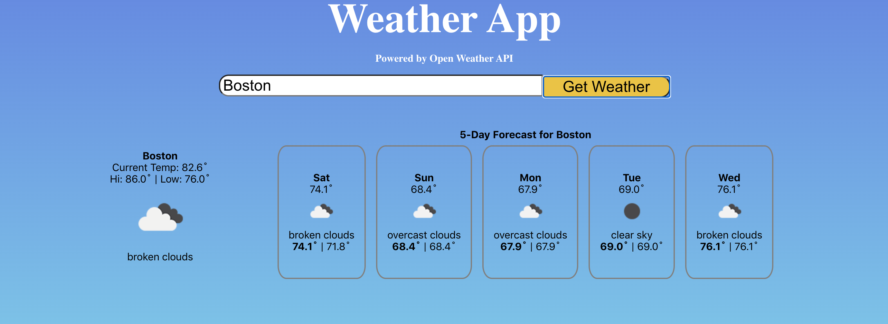

Simple React application that displays weather information fetched from the backend (NodeJs) using the Open Weather API.

# Install & Setup
1. Open the command line/ terminal. Clone the repo to your computer and `cd` into the project directory.
2. Open a new command line shell (still `cd`'d in project directory!)
3. With two command shells open, do the following:
  - First shell (backend): run `node backend`
  - Second shell (frontend): run `npm install && npm start`  

# Usage
Simply type a name of a city (ex: "Boston", "New York", "Berlin") and click the "Get Weather" button.

If the city's weather data exists in Open Weather's API, the current weather and 5-day forecasts will appearing, displaying information such as:

- Current Temp
- Hi/ Low Temp
- General weather forecast

# Contributing
Any and all suggesting are welcome! Please feel free to [submit a pull-request](https://github.com/Dusch4593/weather-app/pulls) or https://github.com/Dusch4593/weather-app/issues.

# Licence
This app is available as open source under the terms of the [MIT License](https://opensource.org/licenses/MIT)
